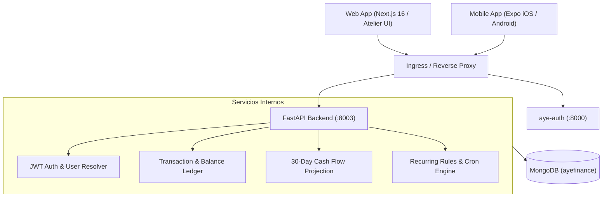

# AyeFinance — Personal Finance & Cash Flow Engine


**AyeFinance** es la aplicación de gestión financiera personal y proyección de liquidez del ecosistema **AyeApps**. Permite administrar múltiples cuentas (débito, crédito, ahorro, inversiones), registrar transferencias y gastos categorizados, programar suscripciones recurrentes y proyectar automáticamente el flujo de efectivo a 30 días.

---

## Por qué este Stack

- **FastAPI + Beanie ODM (MongoDB):** Los registros financieros requieren cálculos de saldo consistentes y validación estricta de tipos en tiempo de ejecución. Beanie integra Pydantic v2 directamente sobre Motor, garantizando schemas seguros sin la sobrecarga de un ORM relacional pesado.
- **Aislamiento Horizontal Estricto:** Toda operación de lectura/escritura filtra forzosamente por el `user_id` extraído criptográficamente del JWT emitido por `aye-auth`.
- **Motor de Proyección a 30 Días:** Algoritmo determinista en backend que calcula saldos diarios esperados considerando ingresos fijos, recurrencias activas y patrones históricos sin depender de servicios bancarios externos frágiles.
- **Frontend Dual (Web Atelier + Expo Mobile):** Versión web en Next.js 16 para análisis exhaustivo en pantalla grande y cliente React Native con Expo CNG para registro ágil de transacciones desde iOS y Android.

---

## Topología de Arquitectura



---

## Estructura del Repositorio

```
ayefinance/
├── backend/                  # FastAPI 0.115 + Beanie ODM + MongoDB
│   ├── app/
│   │   ├── api/v1/           # Endpoints (auth, accounts, transactions, recurring, forecast)
│   │   ├── core/             # Configuración, JWT decode, rate limiting, logging
│   │   ├── db/               # Inicialización de Beanie y colecciones
│   │   ├── models/           # Account, Transaction, RecurringRule, User
│   │   ├── schemas/          # Schemas Pydantic con validadores monetarios
│   │   ├── services/         # Ledger service, proyecciones a 30d, reconciliación
│   │   └── tests/            # Tests unitarios e integración con mongomock
│   ├── Dockerfile            # Multi-stage non-root container
│   ├── requirements.txt      # Dependencias backend
│   └── main.py               # Entrypoint FastAPI
├── web/                      # Portal Web (Next.js 16 + React 19 + Tailwind v4)
│   ├── src/app/              # App Router ((auth), (dashboard), accounts, analytics)
│   └── src/components/       # UI Atelier (StatCards, CashFlowChart, TxModal)
├── mobile/                   # App Móvil (React Native + Expo SDK 57)
│   ├── src/                  # Vistas móviles, AuthScreen, escáner de tickets
│   └── build.sh              # Pipeline de compilación nativa
├── docker-compose.yml        # Orquestación de desarrollo local
└── docker-compose.prod.yml   # Orquestación de producción
```

---

## Variables de Entorno

### Backend (`backend/.env`)
```env
APP_NAME=AyeFinance
APP_ENV=development
PORT=8003
MONGODB_URL=mongodb://localhost:27017/ayefinance
DATABASE_NAME=ayefinance
JWT_SECRET_KEY=clave_compartida_con_aye_auth_minimo_32_caracteres
CORS_ORIGINS=["http://localhost:3000","http://localhost:8081","https://finance.ayeapps.com"]
```

### Frontend (`.env` / `web/.env.local`)
```env
EXPO_PUBLIC_API_URL=http://localhost:8003/api/v1
EXPO_PUBLIC_AUTH_API_URL=http://localhost:8000/api/v1
```

---

## Inicio Rápido (< 3 minutos)

### 1. Iniciar Backend
```bash
cd backend
python3.12 -m venv venv
source venv/bin/activate
pip install -r requirements.txt

uvicorn main:app --reload --port 8003
```
- API Docs: [`http://localhost:8003/docs`](http://localhost:8003/docs)
- Health Check: [`http://localhost:8003/health`](http://localhost:8003/health)

### 2. Iniciar Frontend Web
```bash
cd web
npm install
npm run dev
```
- URL local: [`http://localhost:3000`](http://localhost:3000)

### 3. Iniciar App Móvil
```bash
cd mobile
npm install
npx expo start
```

### 4. Ejecutar Suite de Tests
```bash
cd backend
source venv/bin/activate
pytest app/tests
```

---

## Endpoints Clave

| Método | Ruta | Descripción |
| :--- | :--- | :--- |
| `GET` | `/api/v1/accounts` | Lista de cuentas bancarias y balances calculados |
| `POST` | `/api/v1/accounts` | Crear una nueva cuenta financiera |
| `GET` | `/api/v1/transactions` | Transacciones con filtrado por fecha, cuenta y categoría |
| `POST` | `/api/v1/transactions` | Registrar ingreso/gasto con actualización atómica de balance |
| `GET` | `/api/v1/forecast/30-days` | Proyección matemática de liquidez a 30 días |
| `GET` | `/api/v1/recurring` | Lista de gastos recurrentes y suscripciones activas |
